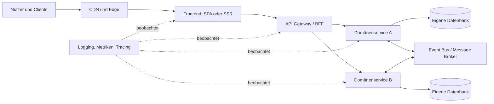

# Anmerkungen zu Kapitel 2 — Theoretischer Hintergrund

## Allgemein

**Anweisung an das LLM:** Halte dich nicht sklavisch an die vorgegebene Gliederung.
Arbeite die Abschnitte nicht nur oberflächlich ab, sondern geh inhaltlich in die Tiefe.
Drücke dich nicht zu knapp aus – lieber ausführlich und präzise als kurz und vage.
Während des Schreibens sollen auch Annahmen (z.B. zum Allgemeinwissen) explizit genannt und hinterfragt werden; stimme diese vorab mit dem Prof ab.

## Zu 2.1 — KI-gestützte Coding-Tools

Es ist zu prüfen, ob die Quellen (insbesondere Quelle 1) belastbar sind.
Viele Coding-Tools werden genannt, deren tatsächliche Verwendung im Projekt hinterfragt werden muss.

Derzeit sind alle Tools in einem Fließtext verfasst.
Hier wäre eine Aufteilung in Absätze und eine Gruppierung sinnvoll:

- Fullstack-Tools
- Frontend-Fokus
- CLI / IDE-Agents
- Nische / Gimmicks

Ergänzend sind ein Ranking der Beliebtheit sowie ein Hinweis darauf angebracht, dass sich das KI-Feld schnell wandelt und die Liste nur einen groben Überblick bietet.

### Gemeinsamkeiten der Tools

Die Gemeinsamkeiten sollten stärker herausgearbeitet werden, darunter:

- Kostenlose Nutzung mit täglichen Limits
- Langfristige Strategie durch App-Deployment
- Vollständige Abhängigkeit von KI
- Gamification-Ansätze
- Entstehung technischer Schulden im Verdeckten

## Zu 2.1.2 — Kritische Aspekte

Es sind weitere kritische Aspekte zu ergänzen:

- **Sicherheit bei neuen Paketen**
- **Wartbarkeit** als Konsequenz des Missachtens des DRY-Prinzips
- **Cognitive Load**, Kompatibilität und Fehleranfälligkeit
- **„KI-Slop“** – ein zentrales Risiko durch zu hohe Erwartungen an Produktivitätssteigerungen, bei denen Qualitätsprobleme zu schnell synthetisiert werden
- **Mangelnde Dokumentation**, oft mit dem Mindset: „KI wird es schon erklären“
- **Drohender Verlust des systemischen Überblicks**
- **Fehlende Konzepte für die Datenhaltung** – insbesondere eine Quick-and-Dirty-Datenbankerstellung ohne Normalisierung und Konsistenz
- **Mangelnde Abstraktion und Wiederverwendbarkeit** des Codes, was den Entwicklungsfortschritt langfristig gefährden kann

Die systematische Überprüfung aller verwendeten Quellen bleibt essenziell.

## Zu 2.2.1 - Kritische Aspekte

wir können noch die anderen aspekte der typischen web-architektur noch behandeln hier eine auslistung

### 2.2.1 Charakteristika moderner Web-Architekturen

Moderne Web-Architekturen sind darauf ausgelegt, digitale Anwendungen **skalierbar, wartbar, sicher und flexibel** bereitzustellen. Anders als klassische monolithische Anwendungen bestehen sie häufig aus klar getrennten Komponenten, die unabhängig entwickelt, getestet und betrieben werden können.

### Zentrale Merkmale

- **Trennung von Frontend und Backend** 
 Die Benutzeroberfläche und die Geschäftslogik werden getrennt umgesetzt. Das Frontend kommuniziert über standardisierte Schnittstellen wie REST, GraphQL oder gRPC mit dem Backend. Dadurch können verschiedene Clients – etwa Web, Mobile oder externe Partner – dieselben Backend-Funktionen nutzen.

- **Komponenten- und Serviceorientierung** 
 Anwendungen werden in fachlich abgegrenzte Module oder Microservices unterteilt. Jeder Service übernimmt eine klar definierte Verantwortung, beispielsweise Benutzerverwaltung, Bestellabwicklung oder Zahlungsabwicklung.

- **API-First-Ansatz** 
 Schnittstellen werden frühzeitig spezifiziert und als zentrale Verträge zwischen Systemen betrachtet. Dies erleichtert die Integration, parallele Entwicklung von Frontend und Backend sowie die Wiederverwendung von Funktionen.

- **Cloud-Native-Betrieb** 
 Moderne Anwendungen werden häufig containerisiert, beispielsweise mit Docker, und über Plattformen wie Kubernetes betrieben. Dadurch lassen sich Komponenten automatisiert bereitstellen, skalieren und überwachen.

- **Horizontale Skalierbarkeit** 
 Bei steigender Last werden nicht zwingend leistungsfähigere Server benötigt. Stattdessen können mehrere Instanzen eines Dienstes parallel betrieben werden. Ein Load Balancer verteilt eingehende Anfragen auf diese Instanzen.

- **Asynchrone Kommunikation** 
 Neben synchronen API-Aufrufen nutzen moderne Architekturen häufig Nachrichtenbroker oder Event Streams. Ereignisse wie „Bestellung eingegangen“ können damit entkoppelt an mehrere Systeme verteilt werden. Dies verbessert Skalierbarkeit und Ausfallsicherheit.

- **Dezentrale Datenhaltung** 
 Insbesondere bei Microservices besitzt ein Service idealerweise seine eigene Datenhaltung. Dadurch werden Abhängigkeiten zwischen Teams und Komponenten reduziert. Gleichzeitig steigen jedoch die Anforderungen an Datenkonsistenz und Transaktionsmanagement.

- **Automatisierung durch DevOps und CI/CD** 
 Build-, Test- und Deployment-Prozesse sind weitgehend automatisiert. Änderungen können dadurch schneller, reproduzierbar und mit geringerem Risiko in verschiedene Umgebungen überführt werden.

- **Beobachtbarkeit (Observability)** 
 Logging, Metriken und Distributed Tracing ermöglichen es, das Verhalten verteilter Systeme nachvollziehbar zu machen. Dies ist besonders wichtig, da Fehlerursachen über mehrere Services hinweg liegen können.

- **Security by Design** 
 Sicherheitsaspekte werden bereits bei Architektur und Entwicklung berücksichtigt. Dazu gehören Identitäts- und Zugriffsmanagement, verschlüsselte Kommunikation, sichere API-Absicherung, Geheimnisverwaltung sowie regelmäßige Sicherheitsprüfungen.

### Vorteile

- Hohe Flexibilität bei fachlichen Änderungen 
- Unabhängige Skalierung einzelner Komponenten 
- Schnellere und häufigere Releases 
- Bessere Wiederverwendbarkeit über APIs 
- Höhere Ausfallsicherheit durch redundante Komponenten 

### Herausforderungen

- Steigende technische und organisatorische Komplexität 
- Verteilte Fehleranalyse und aufwendigeres Monitoring 
- Umgang mit Datenkonsistenz über mehrere Services hinweg 
- Höherer Bedarf an Automatisierung, Plattformkompetenz und klaren Schnittstellenverträgen 

Eine moderne Web-Architektur sollte daher nicht automatisch auf möglichst viele Microservices setzen. Die Wahl zwischen Monolith, modularisiertem Monolith und Microservices hängt vor allem von Domänenkomplexität, Teamstruktur, Skalierungsbedarf und Betriebsreife ab.

## Gesamteindruck

Der Draft ist **klar gegliedert, gut lesbar und argumentativ auf das Transformationsziel ausgerichtet**. Das größte Potenzial liegt weniger im Aufbau als in der **fachlichen Präzisierung und Eingrenzung**: An mehreren Stellen werden Eigenschaften einer bestimmten, cloud-zentrierten SPA-/BaaS-Architektur als allgemeine Merkmale moderner Webanwendungen dargestellt.

## 1. Gegenstand enger definieren

Der Titel **„Charakteristika moderner Web-Architekturen“** ist für den tatsächlich beschriebenen Ausschnitt zu breit. Moderne Webarchitekturen umfassen ebenso:

- serverseitig gerenderte Anwendungen,
- Progressive Web Apps,
- offlinefähige Anwendungen,
- Edge- und Hybridarchitekturen,
- Local-First-Webanwendungen,
- klassische Mehrseitenanwendungen,
- Anwendungen mit lokaler Persistenz über IndexedDB.

Dein Text beschreibt hauptsächlich eine **cloud-zentrierte SPA mit BaaS-Backend**, wie sie häufig von KI-Entwicklungswerkzeugen erzeugt wird.

### Mögliche präzisere Überschrift

> **2.2.1 Charakteristika cloud-zentrierter Web-Prototypen**

oder:

> **2.2.1 Referenzarchitektur KI-generierter Web-Anwendungen**

### Präzisierter Einstieg

> Dieser Abschnitt beschreibt die in dieser Arbeit betrachtete Referenzarchitektur: einen KI-generierten, cloud-zentrierten Web-Prototyp auf Basis eines clientseitigen Frontend-Frameworks und eines entfernten Backends. Die dargestellten Merkmale sind daher nicht als allgemeingültige Eigenschaften sämtlicher moderner Webanwendungen zu verstehen, sondern als Ausgangszustand der nachfolgend untersuchten Transformation.

Dieser Scope-Satz würde viele spätere Verallgemeinerungen entschärfen.

---

## 2. Statelessness fachlich differenzieren

Hier besteht das größte fachliche Präzisierungspotenzial.

### Problematische Aussage

> Das Server-seitige Programm hat daher keine Information über vorher von diesem Client gesendete Anfragen und startet mit jedem Request quasi bei Null.

Das ist zu absolut. HTTP stellt zwar keine Sitzung automatisch bereit, eine serverseitige Anwendung **kann aber sehr wohl Session-Zustand verwalten** und Requests beispielsweise über eine Session-ID einer Sitzung zuordnen.

Außerdem sollte unterschieden werden zwischen:

1. **HTTP als zustandslosem Anwendungsprotokoll**, 
2. **Statelessness als REST-Architekturprinzip**, 
3. **einer zustandsbehafteten Anwendungssitzung**.

### Präzisere Formulierung

> HTTP stellt zwischen zwei Anfragen nicht automatisch einen Anwendungskontext bereit. Jeder Request muss daher alle Informationen enthalten, die zu seiner Zuordnung und Verarbeitung erforderlich sind. Anwendungen können dennoch sitzungsbezogenen Zustand verwalten, etwa indem der Client ein Session-Cookie oder Token mitsendet und der Server darüber auf einen zentral gespeicherten Sitzungszustand zugreift.

Auch diese Formulierung ist problematisch:

> ein Muster, das als *stateful protocol* auf Application-Level bezeichnet wird

Die Anwendung kann **zustandsbehaftete Sitzungssemantik** implementieren; dadurch wird HTTP aber nicht zu einem „stateful protocol“.

Besser:

> Auf Anwendungsebene entsteht dadurch eine zustandsbehaftete Sitzung, obwohl HTTP selbst keinen sitzungsübergreifenden Zustand verwaltet.

### Skalierbarkeit ebenfalls einschränken

> Diese Statelessness hat wesentliche Vorteile für die Skalierbarkeit, da Server-Anfragen unabhängig voneinander auf beliebige Server-Instanzen verteilt werden können, ohne dass Session-State synchronisiert werden muss.

Das gilt nur, wenn die **Anwendungsinstanzen selbst keinen lokalen Session-State halten**. Liegt der Zustand in einem zentralen Session Store, muss er zwar nicht zwischen Instanzen synchronisiert werden, bleibt aber eine gemeinsam genutzte Abhängigkeit.

Besser:

> Zustandslose Anwendungsinstanzen erleichtern die horizontale Skalierung, da Requests prinzipiell auf beliebige Instanzen verteilt werden können. Voraussetzung ist, dass sitzungsbezogener Zustand entweder im Request enthalten oder in einer gemeinsam erreichbaren Persistenzschicht abgelegt wird.

---

## 3. Browser nicht pauschal als Thin Client darstellen

Der Abschnitt beginnt mit einer klassischen Thin-Client-Architektur, beschreibt danach aber SPAs, bei denen der Browser gerade **kein reiner Thin Client mehr ist**.

### Zu absolute Aussagen

> Der Browser selbst enthält keinen persistenten Zustand.

Browser verfügen unter anderem über:

- Cookies,
- Local Storage,
- Session Storage,
- IndexedDB,
- Cache API,
- Service Worker,
- teilweise Dateisystemzugriffe.

Du erwähnst zwar Cookies und Local Storage, aber die Grundbehauptung bleibt zu stark.

Besser:

> In klassischen serverzentrierten Architekturen wird der Browser überwiegend als Präsentationsschicht eingesetzt. Moderne Browser stellen jedoch verschiedene Mechanismen zur lokalen Persistenz bereit, darunter Cookies, Web Storage, IndexedDB und die Cache API. Ob und in welchem Umfang diese genutzt werden, hängt von der jeweiligen Anwendungsarchitektur ab.

### Ebenfalls zu eng

> Browser und Frontend-Framework verwalten nur eine visuelle Repräsentation des Applikationszustands.

SPAs verwalten häufig auch:

- Validierungs- und Workflowlogik,
- optimistische Updates,
- komplexen UI- und Domänenzustand,
- clientseitige Berechnungen,
- lokale Caches,
- teilweise vollständige Offline-Datenmodelle.

Besser:

> Das Frontend verwaltet typischerweise UI-Zustand und kann darüber hinaus Teile der Validierungs-, Workflow- und Geschäftslogik ausführen. In der hier betrachteten Referenzarchitektur verbleibt die autoritative, dauerhaft persistierte Datenbasis jedoch im Cloud-Backend.

Damit passt die Aussage besser zu deinem konkreten Untersuchungsgegenstand.

---

## 4. Webarchitektur und Cloud-Abhängigkeit nicht gleichsetzen

Diese Formulierung ist inhaltlich und stilistisch kritisch:

> da er die Cloud-Abhängigkeit als konstitutiv für die Web-Architektur outet

Cloud-Abhängigkeit ist **nicht konstitutiv für Webarchitektur**. Eine Webanwendung kann lokal laufen, offlinefähig sein oder ein lokales Backend verwenden.

Besser:

> Dieser Umstand verdeutlicht die Cloud-Abhängigkeit der hier betrachteten Referenzarchitektur und ist daher für die nachfolgende Transformation in eine lokal ausgeführte Anwendung von zentraler Bedeutung.

„Outet“ wirkt zudem für einen wissenschaftlichen Text zu umgangssprachlich.

---

## 5. „Single Source of Truth“ und Echtzeitfähigkeit relativieren

### Zu allgemeine Aussage

> Die Datenhaltung moderner Web-Anwendungen erfolgt durchgängig server-seitig in einer Datenbank.

Das ist empirisch und technisch nicht haltbar. Präziser:

> In der hier betrachteten cloud-zentrierten Referenzarchitektur erfolgt die dauerhafte Datenhaltung überwiegend in einer entfernten Datenbank.

### „Echtzeit-Synchronisation“ ist nicht automatisch gegeben

> Jede Datenänderung [...] wird sofort auf dem Server persistiert und steht damit allen anderen [...] unmittelbar zur Verfügung.

Das ist keine allgemeine Eigenschaft zentraler Datenhaltung. Dafür braucht es unter anderem:

- erfolgreiche Übertragung,
- serverseitige Transaktion,
- passende Berechtigungen,
- Push- oder Subscription-Mechanismen,
- gegebenenfalls Cache-Invalidierung,
- clientseitige Aktualisierung.

Besser:

> **Zentrale Synchronisation:** Datenänderungen werden über das Backend persistiert. Je nach technischer Umsetzung können andere Clients die Änderungen bei einer erneuten Abfrage oder über Echtzeitmechanismen wie WebSockets beziehungsweise Subscriptions erhalten.

### „Single Source of Truth“ genauer verwenden

Der Begriff kann sich auf verschiedene Ebenen beziehen:

- autoritative Persistenz,
- UI-State,
- Cache,
- Identitätsverwaltung,
- Konfiguration.

Du meinst offenbar die **autoritative Datenquelle**. Diesen Begriff würde ich bevorzugen, da er weniger missverständlich ist.

---

## 6. BaaS und Sicherheitsverantwortung genauer formulieren

Diese Aussage ist zu stark:

> verlagert jedoch Sicherheitsverantwortung [...] vollständig auf die Nutzenden

Bei BaaS besteht typischerweise eine **geteilte Verantwortung**:

- Der Anbieter verantwortet unter anderem Plattformbetrieb und technische Basismechanismen.
- Das Entwicklungsteam verantwortet Datenmodell, Security Rules, Rollen, Zugriffskontrollen und sichere Clientkonfiguration.

Besser:

> Dieses Muster reduziert die initiale Entwicklungskomplexität, erhöht jedoch die Bedeutung einer korrekten anwendungsseitigen Konfiguration. Insbesondere fehlerhafte Security Rules, Row-Level-Security-Regeln oder Berechtigungskonzepte können dazu führen, dass Clients unzulässig auf Daten zugreifen.

Das ist fachlich belastbarer als die pauschale Aussage, die Verantwortung werde „vollständig“ verlagert.

---

## 7. „Lokale Ausführung“ und „Local First“ trennen

Der Text setzt teilweise drei unterschiedliche Zielbilder gleich:

1. **Desktop-Anwendung:** Die Anwendung läuft in Electron oder einer ähnlichen Runtime.
2. **Lokale Persistenz:** Daten werden beispielsweise in SQLite gespeichert.
3. **Local First:** Lokale Daten sind primär; Synchronisation mit anderen Geräten oder einem Server ist optional beziehungsweise nachgelagert.

Diese Konzepte hängen zusammen, sind aber nicht identisch. Eine Electron-Anwendung kann vollständig cloudabhängig bleiben. Umgekehrt kann eine Browseranwendung local-first und offlinefähig sein.

Ein kurzer Abgrenzungsabsatz wäre hilfreich:

> Die lokale Ausführung einer Anwendung ist nicht automatisch mit einer Local-First-Architektur gleichzusetzen. Eine Desktop-Anwendung kann weiterhin ausschließlich auf ein Cloud-Backend zugreifen. Local First bezeichnet dagegen ein Datenhaltungs- und Synchronisationsmodell, bei dem lokale Datenbestände die primäre Grundlage der Interaktion bilden und Netzwerkzugriffe nicht für jede Operation erforderlich sind.

---

## 8. Migrationsprobleme weniger absolut formulieren

### Offlinefähigkeit

> Das Request-Response-Modell setzt eine permanente Netzwerkverbindung voraus.

Nicht das Request-Response-Modell selbst setzt eine permanente Verbindung voraus, sondern die **ausschließliche Abhängigkeit von entfernten Ressourcen**.

Besser:

> **Eingeschränkte Offlinefähigkeit:** Da Daten und zentrale Funktionen ausschließlich über entfernte Dienste verfügbar sind, können die betreffenden Funktionen ohne Netzwerkverbindung nicht oder nur eingeschränkt genutzt werden.

### Lokale State-Verwaltung

> Keine lokale State-Verwaltung

Das ist missverständlich, weil React-Anwendungen selbstverständlich lokalen State verwalten. Gemeint ist vermutlich **keine dauerhafte lokale Datenhaltung**.

Besserer Aufzählungspunkt:

> **Keine dauerhafte lokale Persistenz:** Flüchtiger UI-State und clientseitige Caches ersetzen keine eingebettete Persistenzschicht. Für die lokale Ausführung muss daher ein Datenmodell für beispielsweise SQLite oder eine vergleichbare lokale Datenbank entwickelt werden.

### Authentifizierung

> muss durch lokale Benutzerregistrierung und -verwaltung ersetzt werden

Das muss nicht zwingend geschehen. Mögliche Zielmodelle sind:

- lokale Benutzerverwaltung,
- Betrieb ohne Benutzerkonten,
- Beibehaltung von OAuth oder zentraler Identität,
- hybrides Identitätsmodell.

Besser:

> **Anpassung des Identitätsmodells:** Es ist zu entscheiden, ob die bestehende cloudbasierte Authentifizierung beibehalten, durch lokale Benutzerverwaltung ersetzt oder für einen Einzelbenutzerbetrieb vollständig entfernt wird.

---

## 9. Technologieauflistung überprüfen und typologisch sauberer machen

Die Aufzählung vermischt teilweise verschiedene Kategorien:

- React, Vue, Angular und Svelte: UI-Frameworks beziehungsweise Bibliotheken
- Vite: Build- und Entwicklungswerkzeug
- Next.js: Framework mit Rendering-, Routing- und Serverfunktionen
- Redux/Zustand/Context: Client-State-Management
- TanStack Query: Server-State- und Cache-Management

Gerade die Unterscheidung zwischen **Client State** und **Server State** ist hier fachlich wertvoll.

### Vorschlag

- **Frontend-Frameworks und UI-Bibliotheken:** React, Angular, Vue oder Svelte
- **Build- und Entwicklungswerkzeuge:** Vite
- **Full-Stack- beziehungsweise Meta-Frameworks:** Next.js, Nuxt oder SvelteKit
- **Client-State-Management:** Redux, Zustand oder React Context
- **Server-State-Management:** TanStack Query oder SWR
- **Persistenz und Backenddienste:** Supabase, Firebase oder verwaltete Datenbanken

### TanStack Query

> Dieser Cache ist flüchtig — er überlebt einen Seiten-Reload nicht.

Das gilt **standardmäßig**, kann aber durch Persistenzmechanismen geändert werden.

Besser:

> Der Cache ist standardmäßig flüchtig, kann jedoch durch zusätzliche Persistenzmechanismen über Seitenneuladungen hinweg gespeichert werden.

Auch die konkrete Einordnung von **Replit DB als „MongoDB-ähnlich“** solltest du anhand der verwendeten Produktversion und einer belastbaren Quelle prüfen.

---

## 10. Quellenbasis wissenschaftlich stärken

Für zentrale Architekturbegriffe würde ich Wikipedia möglichst nicht als Hauptquelle verwenden. Insbesondere bei folgenden Themen bieten sich Primär- oder Standardquellen an:

- HTTP und Statelessness: einschlägige RFCs
- REST-Statelessness: Fieldings Dissertation
- Browserpersistenz: Standards oder MDN-Dokumentation
- BaaS-Sicherheitsmodell: offizielle Supabase-/Firebase-Dokumentation
- Electron-Architektur und -Sicherheit: offizielle Electron-Dokumentation
- Local First: wissenschaftliche beziehungsweise etablierte konzeptionelle Veröffentlichungen

Bei empirischen Aussagen wie:

> „typischerweise von KI-gestützten Entwicklungswerkzeugen erzeugt“

oder:

> „kommt häufig ein BaaS wie Supabase, Firebase oder Replit zum Einsatz“

brauchst du idealerweise entweder:

- eine Studie,
- eine dokumentierte Stichprobe,
- eine eigene systematische Analyse,
- oder eine vorsichtigere Formulierung wie „kann häufig beobachtet werden“.

---

## 11. Sprachliche und formale Korrekturen

Einige konkrete Stellen:

| Aktuell | Vorschlag |
|---|---|
| „Server-seitig“ | „serverseitig“ |
| „Client-seitig“ | „clientseitig“ |
| „resideieren“ | „liegen“ oder „gespeichert werden“ |
| „via Cookies“ | „über Cookies“ |
| „Cloud-Abhängigkeit … outet“ | „Cloud-Abhängigkeit … verdeutlicht“ |
| „Entwicklingskomplexität“ | „Entwicklungskomplexität“ |
| „architecturische Konsequenzen“ | „architektonische Konsequenzen“ |
| „verbindliche Netzwerkverbindung“ | „bestehende“ oder „stabile Netzwerkverbindung“ |
| „reprimär“ | vermutlich „primär“ |
| „Access-Controls“ | „Zugriffskontrollen“ |
| „komplett neu geladen“ | „vollständig neu geladen“ |
| „State-Information“ | „Zustandsinformation“ |
| „State-Verwaltung“ | „Zustandsverwaltung“ |

Außerdem würde ich deutsche und englische Fachbegriffe konsistenter einsetzen. Wenn du „State“, „Access Control“ und „Single Source of Truth“ verwendest, solltest du sie einmal definieren und anschließend einheitlich nutzen.

---

## 12. Schlussabsatz grammatikalisch korrigieren

Der letzte Satz ist aktuell syntaktisch fehlerhaft:

> Unterabschnitt [...] diskutiert [...] und das Transformationsziel Kapitel [...] führt [...]

Hier fehlt mindestens eine Satztrennung.

### Überarbeitete Version

> Diese Transformation – der Übergang von einer cloud-zentrierten Webanwendung zu einer lokal ausgeführten Desktop-Anwendung mit dauerhafter lokaler Persistenz – bildet das zentrale Themenfeld der folgenden Abschnitte. Unterabschnitt~\ref{sec:desktop-runtimes} stellt Electron als Brückentechnologie für die Ausführung von Webtechnologien auf dem Desktop vor. Unterabschnitt~\ref{sec:electron-security} diskutiert die daraus entstehenden sicherheitsrelevanten Konsequenzen. Kapitel~\ref{sec:local-first} führt anschließend das Local-First-Paradigma als mögliches architektonisches Zielbild ein.

Ich würde hier außerdem nicht pauschal von einer Transformation von „stateless“ zu „persistent“ sprechen: **Statelessness und Persistenz sind keine direkten Gegensätze**. Eine Anwendung kann eine persistente Datenbank verwenden und trotzdem zustandslose Serverinstanzen besitzen.

---

## Priorisierung

Wenn du nur die wichtigsten Punkte überarbeitest, würde ich in dieser Reihenfolge vorgehen:

1. **Scope im Titel und Einstieg auf cloud-zentrierte KI-Prototypen eingrenzen.**
2. **Statelessness fachlich korrigieren.**
3. **Browser nicht mit Thin Client und fehlender Persistenz gleichsetzen.**
4. **Cloudabhängigkeit, Echtzeitfähigkeit und Offlineprobleme relativieren.**
5. **Lokale Ausführung, lokale Persistenz und Local First voneinander abgrenzen.**
6. **Authentifizierung nicht zwingend als lokale Benutzerregistrierung darstellen.**
7. **Wikipedia durch Primär- und Standardquellen ergänzen.**
8. **Anglizismen, Tippfehler und den Schlussabsatz bereinigen.**

Die argumentative Grundlinie ist bereits gut. Mit diesen Präzisierungen würde der Abschnitt deutlich wissenschaftlicher wirken und weniger den Eindruck einer problematisch vereinfachten Gegenüberstellung **„Web = Cloud und stateless“ versus „Desktop = lokal und persistent“** erzeugen.

# Zu s 2.2.2

## Größtes Potenzial

Der Abschnitt ist inhaltlich gut strukturiert: Problem → Electron-Architektur → Alternativen → begründete Auswahl → Überleitung zur Sicherheit. Besonders stark ist, dass du die Runtime-Wahl konsequent am **Wiederverwendungsziel des KI-generierten Web-Stacks** ausrichtest.

Optimierungspotenzial sehe ich vor allem bei **Präzision, wissenschaftlicher Absicherung und sprachlicher Verdichtung**.

---

## 1. Begriffe und formale Fehler bereinigen

- **„Elektron“** muss durchgehend **„Electron“** heißen.
- **„RuntimeType“** wirkt wie ein Platzhalter bzw. ein falsch übernommener Begriff. Besser: 
 *„Desktop-Runtime“*, *„Ausführungsumgebung“* oder *„Desktop-Anwendungsruntime“*.
- **„smalleren Binärgrößen“** → *„kleineren Binärgrößen“*.
- **„thesis“** → *„Arbeit“* oder *„Masterarbeit“*.
- **„bzgl.\“** ist zwar nicht falsch, aber stilistisch weniger elegant. Besser: *„hinsichtlich“* oder *„in Bezug auf“*.

Auch der Titel **„Electron als Brückentechnologie“** verdient eine kurze Begründung: „Brücke“ impliziert, dass Electron ein Übergang zu einer späteren Zielarchitektur ist. Falls Electron hier die gewählte Zielruntime ist, wäre etwa präziser:

> **2.2.2 Desktop-Runtimes: Electron als Integrationsruntime für Web-Anwendungen**

Falls „Brückentechnologie“ bewusst gewählt ist, solltest du im ersten oder letzten Satz erläutern, *zwischen welchen Architekturen* Electron vermittelt.

---

## 2. Pauschale Aussagen stärker eingrenzen

Einige Aussagen sind plausibel, aber sehr absolut formuliert. Das kann in einer wissenschaftlichen Arbeit angreifbar sein.

### KI-generierte Prototypen

> „KI-generierte Web-Prototypen produzieren vollwertige Full-Stack-Anwendungen …“

Das ist zu allgemein. Nicht jeder KI-generierte Prototyp ist „vollwertig“, nicht jeder beinhaltet ein Backend und nicht jeder ist cloudnative konzipiert.

**Präziser:**

> Die in dieser Arbeit betrachteten KI-generierten Web-Prototypen basieren auf einem JavaScript- bzw. TypeScript-Stack und folgen einer webbasierten Client-Server-Architektur. Ihre Bereitstellung ist typischerweise auf eine Ausführung im Browser und eine HTTP-basierte Kommunikation mit Backend-Diensten ausgerichtet.

Damit bindest du die Aussage sauber an dein Untersuchungsobjekt.

### Electron als „einzige bedeutende“ Runtime

> „Electron wird ausgewählt, da es die einzige bedeutende Desktop-Runtime ist …“

Das ist argumentativ unnötig riskant: Es gibt weitere Ansätze, etwa Wails, Neutralinojs oder plattformspezifische WebView-Container. Du musst nicht beweisen, dass Electron die *einzige* Option ist – nur, dass es unter deinen Kriterien die **geeignetste** ist.

**Besser:**

> Unter den betrachteten Desktop-Runtimes weist Electron die höchste Kompatibilität mit dem vorhandenen JavaScript- und TypeScript-Stack auf. Insbesondere ermöglicht Electron die unmittelbare Weiterverwendung sowohl der Web-Frontend-Schicht als auch Node.js-basierter Backend- und Integrationslogik.

---

## 3. Sicherheitsmodell von Electron genauer trennen

Die Darstellung des Zwei-Prozess-Modells ist grundsätzlich richtig, könnte aber technisch präziser sein.

### Renderer-Prozess und Browser-Sicherheit

> „Der Renderer-Prozess … erbt dabei die Sicherheitseinschränkungen eines Browsers …“

Das klingt so, als sei der Renderer automatisch sicher wie ein Browser. In Electron hängt die tatsächliche Isolation aber stark von der Konfiguration ab, etwa von `nodeIntegration`, `contextIsolation`, `sandbox` und einer restriktiven IPC-API.

**Besser:**

> Der Renderer-Prozess rendert die Benutzeroberfläche auf Chromium-Basis. Seine Sicherheitsisolation hängt jedoch wesentlich von der Konfiguration der Electron-Anwendung ab. Insbesondere müssen Node.js-Integration deaktiviert, Context Isolation aktiviert, Sandboxing eingesetzt und privilegierte Funktionen ausschließlich über eine minimal gehaltene Preload- und IPC-Schnittstelle bereitgestellt werden.

Wichtig ist dabei: **Context Isolation und Preload-Skripte sind nicht dieselbe Sicherheitsmaßnahme.**

- **Context Isolation** trennt JavaScript-Kontexte zwischen Web-Inhalten und Preload-Code.
- **Preload-Skripte** stellen kontrolliert Funktionen bereit.
- **Sandboxing** begrenzt die Rechte des Renderer-Prozesses zusätzlich.
- **IPC-Validierung** begrenzt, welche privilegierten Operationen ausgelöst werden können.

Das passt zudem hervorragend als Vorbereitung für deinen folgenden Sicherheitsunterabschnitt.

### Zwei-Prozess-Modell nicht zu absolut darstellen

Electron hat zwar konzeptionell Main- und Renderer-Prozesse, verwendet intern aber zusätzlich beispielsweise GPU-, Utility- oder Crashpad-Prozesse. Für deine Argumentation ist das kein Problem, aber die Formulierung kann etwas vorsichtiger sein:

> Im Zentrum der Electron-Anwendungsarchitektur stehen ein privilegierter Main-Prozess und ein oder mehrere Renderer-Prozesse.

Das ist fachlich robuster als ein strikt formuliertes „Zwei-Prozess-Modell“.

---

## 4. Alternativen differenzierter bewerten

Die Alternativen sind gut gewählt, aber bei Tauri und NW.js würde ich die Aussagen vorsichtiger machen.

### Tauri

> „… erfordert jedoch, dass der gesamte native Backend-Code in Rust implementiert wird.“

Das ist in dieser Absolutheit problematisch. Tauri ist primär Rust-basiert, kann aber beispielsweise externe Prozesse bzw. Sidecars integrieren. Der wichtigere Punkt ist: Eine unmittelbare Wiederverwendung eines Node.js-Backends ist **nicht das Standardmodell** und erzeugt zusätzliche Architektur- und Betriebslogik.

**Vorschlag:**

> Tauri kombiniert ein Web-Frontend mit einem Rust-basierten nativen Backend und verwendet die WebView-Komponente des jeweiligen Betriebssystems. Zwar können externe Prozesse in Tauri-Anwendungen eingebunden werden, eine unmittelbare und gleichwertige Weiterverwendung einer Node.js-basierten Backend-Logik ist jedoch nicht vorgesehen. Für das betrachtete Transformationsszenario würde dies zusätzlichen Integrationsaufwand oder eine partielle Neuimplementierung der privilegierten Anwendungslogik erfordern.

So bleibt dein Kernargument erhalten, ohne Tauri technisch zu stark zu verkürzen.

### NW.js

> „NW.js bietet weder ein eingebautes Context-Isolation-Konzept noch ein Preload-Muster …“

Diese Aussage solltest du unbedingt gegen die aktuelle NW.js-Dokumentation prüfen. Gerade bei Sicherheitsmerkmalen sind absolute Negativaussagen nur sinnvoll, wenn sie sehr gut belegt sind.

Unabhängig davon ist dein eigentlicher Punkt stärker formulierbar:

> NW.js verfolgt ebenfalls einen Chromium- und Node.js-basierten Ansatz. Im Vergleich zu Electron bietet dessen Sicherheitsdokumentation, etabliertes Härtungsmodell und Ökosystem jedoch eine weniger geeignete Grundlage für das in dieser Arbeit verfolgte Ziel einer systematischen Sicherheitsisolation.

Das verschiebt die Argumentation von einer möglicherweise strittigen Feature-Behauptung hin zu einem nachvollziehbaren Auswahlkriterium.

### Flutter

Der Flutter-Abschnitt ist schlüssig. Du könntest noch herausstellen, dass nicht nur UI-Code, sondern auch das **Programmiermodell** und der Build-Prozess wechseln:

> Flutter Desktop setzt auf Dart und die Rendering-Engine Skia statt auf eine browserbasierte Rendering-Umgebung. Die Übernahme des bestehenden HTML-, CSS-, JavaScript- und TypeScript-Codes wäre daher nicht unmittelbar möglich und würde eine vollständige Neuentwicklung der Benutzeroberfläche erfordern.

---

## 5. Kriterien explizit machen

Der Abschnitt enthält implizit bereits klare Auswahlkriterien. Mache diese explizit, damit die Wahl von Electron nicht wie eine bloße Präferenz wirkt:

1. **Wiederverwendbarkeit** des bestehenden JavaScript-/TypeScript-Codes 
2. **Kompatibilität** mit Node.js-basierter Integrationslogik 
3. **Sicherheitsmechanismen** für Prozess- und Rechteisolation 
4. **Zugriff auf Betriebssystemressourcen** 
5. **Migrations- und Betriebsaufwand**

Eine kompakte Tabelle würde die Argumentation stark verbessern:

| Kriterium | Electron | Tauri | NW.js | Flutter Desktop |
|---|---|---|---|---|
| Wiederverwendung von Web-UI-Code | hoch | hoch | hoch | gering |
| Weiterverwendung von Node.js-Logik | hoch | eingeschränkt | hoch | gering |
| Sicherheitsarchitektur für privilegierte APIs | differenziert verfügbar | Rust-/Command-basiert | zu prüfen bzw. weniger etabliert | plattformspezifisch |
| Migrationsaufwand im betrachteten Szenario | gering bis mittel | mittel bis hoch | mittel | hoch |

Die Tabelle sollte natürlich nur Aussagen enthalten, die du mit deinen Quellen belastbar belegen kannst.

---

## 6. Redundanzen reduzieren

Die Wiederverwendbarkeit des JavaScript-/TypeScript-Stacks wird mehrfach genannt. Inhaltlich ist sie zentral, aber du kannst sie einmal präzise begründen und anschließend auf die Sicherheitsdimension fokussieren.

Zum Beispiel lassen sich diese Gedanken zusammenziehen:

> Durch den gemeinsamen JavaScript- und TypeScript-Stack können das bestehende Web-Frontend sowie Teile der Node.js-basierten Anwendungslogik ohne grundlegenden Technologiebruch weiterverwendet werden. Die Migration verlagert den Schwerpunkt damit von einer vollständigen Neuimplementierung auf die kontrollierte Kapselung privilegierter Desktop-Funktionen.

Das ist prägnanter und leitet direkt zur IPC-/Preload-Thematik weiter.

---

## Mögliche überarbeitete Schlussfassung

Als Ersatz für die letzten beiden Absätze bietet sich etwa diese Fassung an:

> Unter den betrachteten Desktop-Runtimes weist Electron die höchste Kompatibilität mit dem JavaScript- und TypeScript-Stack der Ausgangsanwendung auf. Während Tauri zwar eine ressourceneffiziente Alternative auf Basis nativer WebViews darstellt, setzt die privilegierte Anwendungslogik dort primär auf Rust und erschwert damit die unmittelbare Weiterverwendung Node.js-basierter Komponenten. NW.js verfolgt zwar einen Electron-ähnlichen Technologieansatz, bietet jedoch für das in dieser Arbeit betrachtete Sicherheitsziel eine weniger geeignete Grundlage. Flutter Desktop scheidet aufgrund des abweichenden Sprach-, Rendering- und Programmiermodells aus, da eine Übernahme der vorhandenen Web-UI eine vollständige Neuentwicklung erfordern würde.
>
> Electron wird daher als Zielruntime ausgewählt, weil die Technologie eine weitgehende Wiederverwendung des bestehenden Web- und Node.js-Stacks ermöglicht und zugleich Mechanismen zur kontrollierten Kapselung privilegierter Desktop-Funktionen bereitstellt. Diese Wiederverwendbarkeit reduziert den Migrationsaufwand, ersetzt jedoch keine Sicherheitsanalyse: Insbesondere die Trennung von Main- und Renderer-Prozessen, die Gestaltung der Preload-API, die Absicherung der IPC-Kommunikation sowie die Begrenzung von Dateisystemzugriffen sind für die Sicherheit der resultierenden Desktop-Anwendung maßgeblich. Diese Aspekte werden im folgenden Unterabschnitt untersucht.

**Kurz gesagt:** Der Draft ist schon überzeugend. Der größte Gewinn entsteht, wenn du absolute Aussagen abschwächst, das Sicherheitsmodell präziser aufschlüsselst und die Runtime-Entscheidung anhand expliziter Auswahlkriterien argumentierst.